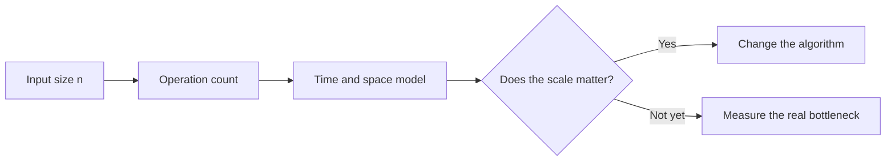

> **Sample entry.** This article demonstrates the writing structure of the site. It is an explanatory note, not a report of a personal experiment.

## The question behind Big O

Complexity notation is often introduced as a ranking: an $O(n)$ algorithm is better than an $O(n^2)$ algorithm. That shortcut is useful, but incomplete. The more practical question is:

> Which part of the cost grows with the input, and which assumptions make that growth relevant?

For an algorithm with input size $n$, we can think about its running time as a function $T(n)$. Asymptotic notation focuses on the shape of that function as $n$ becomes large, while deliberately ignoring constant factors and lower-order terms.

For example, if

$$
T(n) = 3n^2 + 4n + 12,
$$

then the quadratic term dominates the growth and we write $T(n) = O(n^2)$. This is a model of scaling, not a stopwatch reading.

## A small decision map

The diagram matters because a complexity label is only one input to an engineering decision. A linear pass over a large contiguous array may be preferable to a theoretically faster structure with poor locality. Conversely, a quadratic routine that runs once on a tiny input may be the clearest and safest choice.

## Three checks before comparing two algorithms

### 1. Compare the same cost model

Time, memory, communication, and energy are different resources. A method that saves arithmetic operations may require more memory or synchronization. State the resource being analyzed before assigning a label.

### 2. Name the input size

The relevant $n$ is not always the number of records. For graph algorithms it may be $V$ vertices and $E$ edges; for a matrix routine it may be two dimensions. A precise statement such as $O(V + E)$ communicates more than a generic “linear” claim.

### 3. Keep the boundary visible

Asymptotic analysis describes a limit. It does not automatically predict behavior at the sizes available in a real system. A useful note should therefore record both the theoretical model and the observed constraints that could make the model misleading.

## A compact checklist

- Define the input and the resource being measured.
- Count the dominant operation rather than every line of code.
- State assumptions about data structure, hardware, and access pattern.
- Use measurement to locate constants and bottlenecks.
- Treat the final complexity claim as a scoped statement.

The habit worth keeping is not memorizing a table of symbols. It is learning to ask what grows, under which assumptions, and whether that growth is the constraint that matters.
