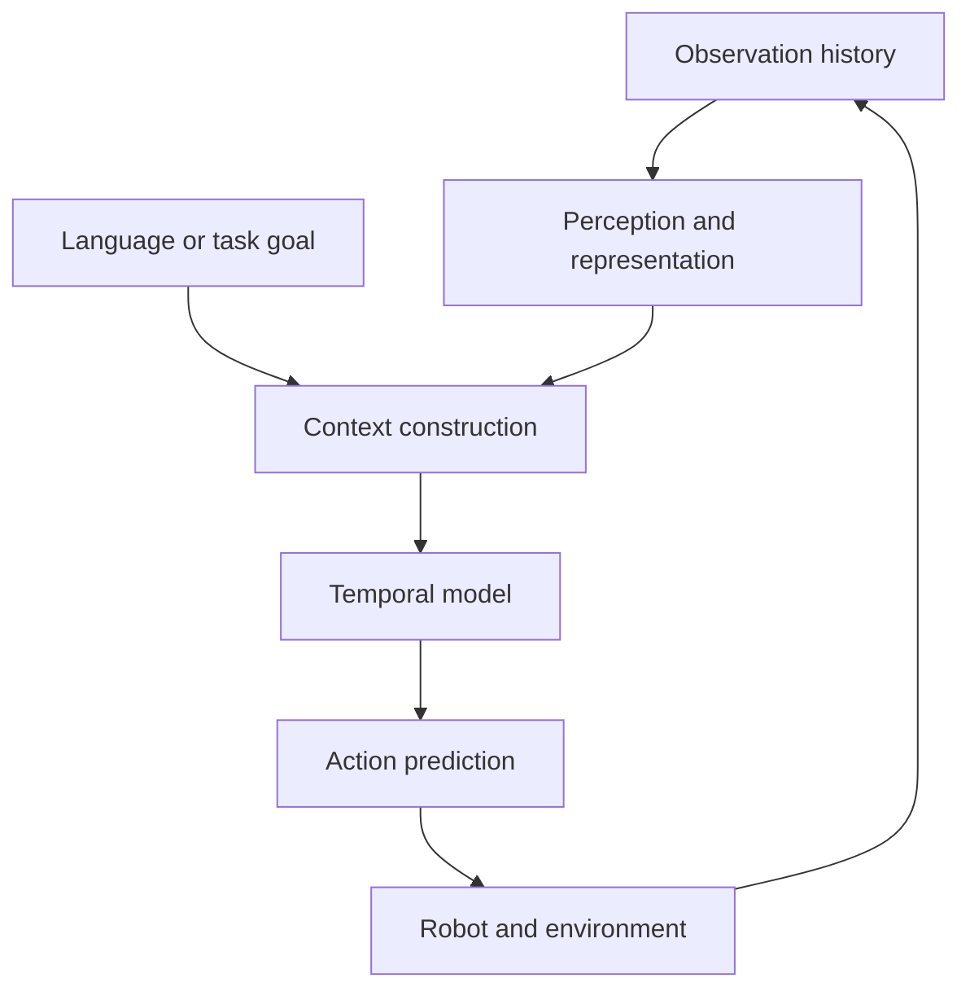

> **Sample entry.** The claims below are a study guide to established model patterns. They do not describe a completed personal system or experimental result.

## Why use a sequence model for control?

A robot controller receives observations over time and produces actions over time. A simplified trajectory can be written as

$$
\tau = (o_1, a_1, o_2, a_2, \ldots, o_T, a_T),
$$

where $o_t$ is an observation and $a_t$ is an action. This representation makes a useful connection to language modeling: both systems predict the next element from a context.

The analogy should be used carefully. Robot actions have geometry, timing, safety constraints, and feedback. Treating an action as a token can provide a convenient interface, but it does not remove the need to reason about the physical system.

## The attention view

For a sequence of representations $X$, self-attention creates queries, keys, and values and combines information across positions:

$$
\operatorname{Attention}(Q,K,V) = \operatorname{softmax}\left(\frac{QK^\top}{\sqrt{d_k}}\right)V.
$$

In a control setting, the context could include recent images, proprioceptive state, language instructions, and previous actions. The model can then produce either one action, a short action chunk, or a distribution over possible futures, depending on the policy design.

## A useful decomposition

The diagram separates interfaces that are often collapsed into a single “end-to-end” label. Each interface raises a different question:

- **Representation:** What information is preserved from the observation?
- **Temporal context:** How much history is needed for the task?
- **Action space:** Are actions continuous vectors, discrete bins, or chunks?
- **Feedback:** How quickly can the policy correct an error?

## What to record while studying

When reading a transformer-based policy paper, it helps to extract the following fields:

| Field | Question |
| --- | --- |
| Input | What observations and goals reach the model? |
| Target | What exactly is predicted: a state, action, chunk, or value? |
| Data | How are trajectories collected, filtered, and split? |
| Evaluation | Which tasks and baselines make the comparison meaningful? |
| Failure | What happens under distribution shift, delay, or unsafe actions? |

This structure keeps architecture details connected to the research question. The goal is not to treat attention as a universal solution, but to understand which assumptions make a sequence model useful for a particular control problem.
